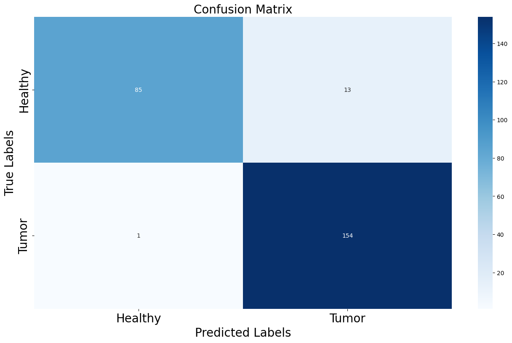

# Brain Tumor Detection with CNN Model

This project uses a Convolutional Neural Network (CNN) to classify brain MRI images into two categories: healthy and tumor.

# Dataset
The dataset is composed of MRI images divided into two classes:
- Tumor images: Located in the `/brain_tumor_dataset/yes` directory.
- Healthy images: Located in the `/brain_tumor_dataset/no` directory.

Each image is resized to a fixed size of `128x128`.

# Model Architecture
The CNN model consists of multiple convolutional layers, followed by fully connected layers for binary classification.

Key components of the model:
- Convolutional Layers: Extract features from the input images.
- ReLU Activation: Applied after each convolution to introduce non-linearity.
- Max Pooling: Reduces the spatial dimensions of the feature maps.
- Fully Connected Layers: Combine the extracted features for classification.

# Training Parameters
- Optimizer: Adam optimizer with a learning rate of 0.0001.
- Epochs: 150 epochs.
- Loss Function: Binary Cross-Entropy (BCE) loss for the binary classification task.
- Batch Size: 10 samples per batch.


# Training loop
```python

 eta = 0.0001
 EPOCH = 150
 optimer = torch.optim.Adam(model.parameters(), lr=eta)
 dataloader = DataLoader(mri, batch_size=10, shuffle=True)
 model.train()


 model = model.to(device)

 for epoch in range(1, EPOCH):
    losses = []
    for D in dataloader:
        optimer.zero_grad()
        data = D['image'].to(device)
        label = D['label'].to(device)
        y_hat = model(data)
        #print(y_hat.shape)
        #print(label)


        # define loss function
        error = nn.BCELoss()
        loss = torch.sum(error(y_hat, label.unsqueeze(1)))
        loss.backward()
        optimer.step()
        losses.append(loss.item())
    if (epoch+1) % 10 == 0:
        print('Train Epoch: {}\tLoss: {:.6f}'.format(epoch+1, np.mean(losses)))

```

# Training loop
Confusion Matrix: A heatmap to show the model's predictions.




